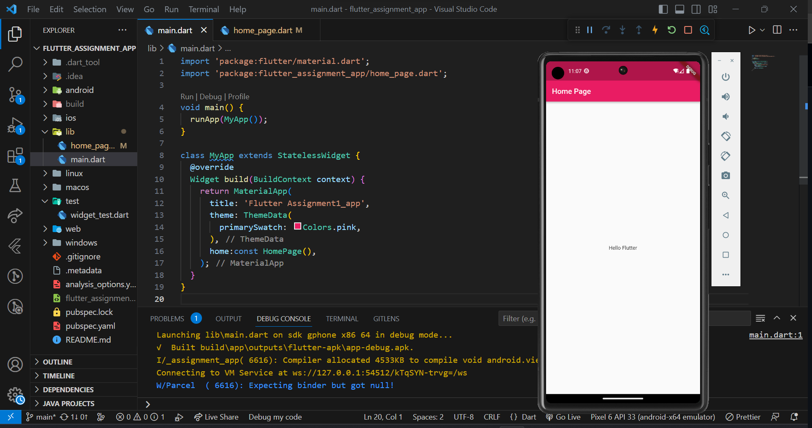

# Simple Flutter application

This application is a basic Flutter app that displays a home page with a title and a centered text widget. The app follows the Material Design guidelines, providing a clean and familiar interface.

The main.dart file sets up the app by creating an instance of the MyApp class and running it using the runApp method. MyApp is a StatelessWidget that defines the MaterialApp widget as the root of the app. MaterialApp sets the title of the app and applies a blue theme. The home property of MaterialApp is set to the HomePage widget.

The home_page.dart file contains the code for the home page of the app. It defines a StatelessWidget called HomePage. The HomePage widget is a Scaffold, which provides a basic layout structure for the page. It includes an AppBar at the top with a title and a body that contains a centered text widget displaying the message "Hello Flutter".

This simple app serves as a starting point for building more complex Flutter applications. It showcases the basic usage of MaterialApp, Scaffold, AppBar, and text widgets, and can be expanded upon to include additional features and functionality.

## Screenshots

